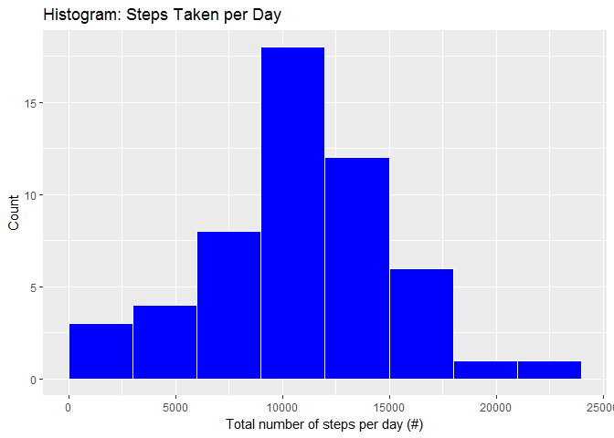
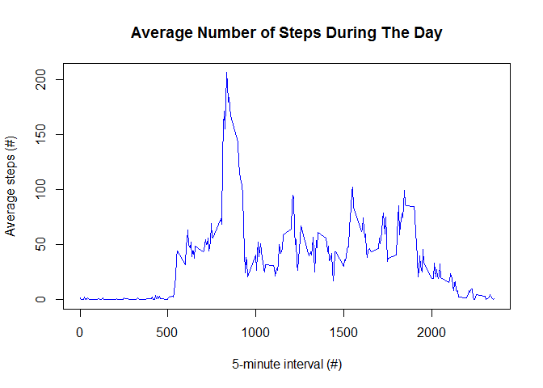
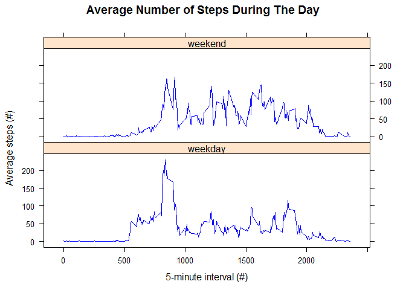

# Reproducible Research: Peer Assessment 1


## Loading and preprocessing the data

The following piece of code will load the needed libraries, read the dataset and store it in a variable called data:

```r
library(ggplot2)
library(zoo)
library(lattice)
data <- read.csv(unz("activity.zip", "activity.csv"))
str(data)
```

```
## 'data.frame':	17568 obs. of  3 variables:
##  $ steps   : int  NA NA NA NA NA NA NA NA NA NA ...
##  $ date    : Factor w/ 61 levels "2012-10-01","2012-10-02",..: 1 1 1 1 1 1 1 1 1 1 ...
##  $ interval: int  0 5 10 15 20 25 30 35 40 45 ...
```

It can be found that the number of **steps** and the **interval** have been recognized as *Integer*, which is ok. However, the **date** has been recognized as a *Factor*. So, let's convert it to *Date* format:

```r
data$date <- as.Date(data$date, format="%Y-%m-%d")
str(data)
```

```
## 'data.frame':	17568 obs. of  3 variables:
##  $ steps   : int  NA NA NA NA NA NA NA NA NA NA ...
##  $ date    : Date, format: "2012-10-01" "2012-10-01" ...
##  $ interval: int  0 5 10 15 20 25 30 35 40 45 ...
```
Now, each field has the proper type and the data is ready to be processed.

## What is mean total number of steps taken per day?

First of all, lets aggregate the number of steps per date (using the *sum* function) and make a histogram of the total number of steps taken each day:


```r
total_steps_per_day <- aggregate(steps~date,data,sum)
ggplot(data = total_steps_per_day, aes(steps)) +
  geom_histogram(breaks=seq(0,24000, by = 3000), col="white", fill="blue",) +
  labs(title = "Histogram: Steps Taken per Day", x="Total number of steps per day (#)", y= "Count")
```

<!-- -->

It seems that most of the samples are around 10/11k steps per day. 
So, lets calculate the mean and median:


```r
mean_steps_per_dat <- mean(total_steps_per_day$steps)
mean_steps_per_dat
```

```
## [1] 10766.19
```

```r
median_steps_per_dat <- median(total_steps_per_day$steps)
median_steps_per_dat
```

```
## [1] 10765
```

## What is the average daily activity pattern?

This time, I will aggregate the steps per interval (using the *mean* function) and plot the results using the *type="l"* proposed:


```r
mean_steps_per_interval <- aggregate(steps~interval,data,mean)
with(mean_steps_per_interval, plot(interval,steps, type = "l", col = "blue", xlab = "5-minute interval (#)", ylab = "Average steps (#)", main = "Average Number of Steps During The Day"))
```

<!-- -->

It seems that the 5-minute interval with more activity is about *id=800*, having an average number of steps arround 200.

Let's be more specific and retrieve the exact interval with more activity in average:


```r
mean_steps_per_interval[mean_steps_per_interval$steps==max(mean_steps_per_interval$steps),]
```

```
##     interval    steps
## 104      835 206.1698
```


## Imputing missing values

This dataset contains some missing values. The following piece of code will calculate the number of them:


```r
total_NA <- sum(is.na(data$steps))
total_NA
```

```
## [1] 2304
```

It seems that there are 2304 intervals with missing steps. The presence of this missing data may introduce bias into some calculations or summaries of the data.

So, let's fill those missing values. I've decided to fill them with the average number of steps of each interval, e.g. if the number of steps is missing in interval 5 on 2012-10-01, it will be filled with the average number of steps calculated over all intervals 5. The following code will duplicate the original dataset (called *data*) and fill the missing NAs in the new one (called *new_data*):


```r
new_data <- data
new_data$steps <- na.aggregate(new_data$steps, by = new_data$interval, fun = mean)
new_data$steps <- round(new_data$steps)
```

Note that the filled steps have been rounded (it makes no sense to have decimal steps :) )


```r
new_total_steps_per_day <- aggregate(steps~date,new_data,sum)
ggplot(data = total_steps_per_day, aes(steps)) +
  geom_histogram(breaks=seq(0,24000, by = 3000), col="white", fill="blue",) +
  labs(title = "Histogram: Steps Taken per Day", x="Total number of steps per day (#)", y= "Count")
```

<!-- -->

It can be found that the new histogram looks pretty similar to the old one.

Let's look now to the new mean and median:


```r
mean(new_total_steps_per_day$steps)
```

```
## [1] 10765.64
```

```r
median(new_total_steps_per_day$steps)
```

```
## [1] 10762
```

They have slightly changed but it is not such a big deal. It seems that the filled NA values have not changed our previous calculations.

## Are there differences in activity patterns between weekdays and weekends?

First of all, let's add a new column to the data frame pointing out whether the day falls in weekday or weekend:


```r
new_data["type"] <- ifelse(weekdays(new_data$date) %in% c("Saturday", "Sunday"), "weekend", "weekday")
new_data$type <- as.factor(new_data$type)
```

Now, we can plot a time series plot (i.e. type = "l") of the 5-minute interval (x-axis) and the average number of steps taken, averaged across all weekday days or weekend days (y-axis):


```r
mean_steps_per_interval_and_type <- aggregate(steps~interval+type,new_data,mean)
with(mean_steps_per_interval_and_type, xyplot(steps ~ interval | type, type = "l", col = "blue", xlab = "5-minute interval (#)", ylab = "Average steps (#)", main = "Average Number of Steps During The Day", layout = c(1, 2)))
```

<!-- -->
